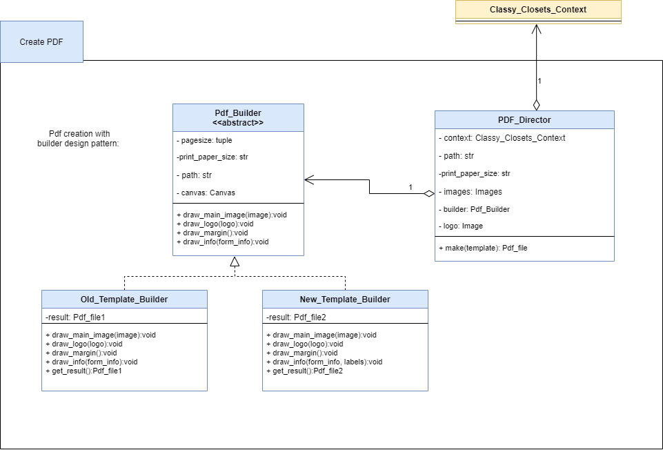
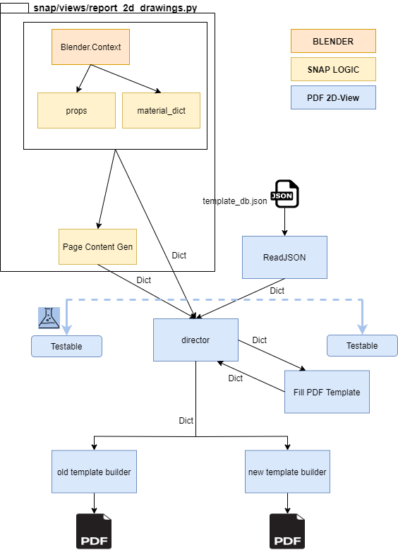

# About PDF Generation
An independent layer for PDF generation is based on the builder pattern, to easily extend the SNaP support of different paper size, legends, and info generation in future legends.

## Builder Pattern
The following picture shows how is used the Builder Pattern to extend new formats. SNaP only needs to talk directly to PDF Director and let it know: 
1. context information from the project,
2. absolute path filename
3. paper size
4. type of format
5. list of png images to be added to the pdf

The pdf legend can be modified from a set a JSON files.

## SNaP integration of the PDF Builder
The following picture shows how is integrated the **pdf_builder** new module into **SNaP**.

